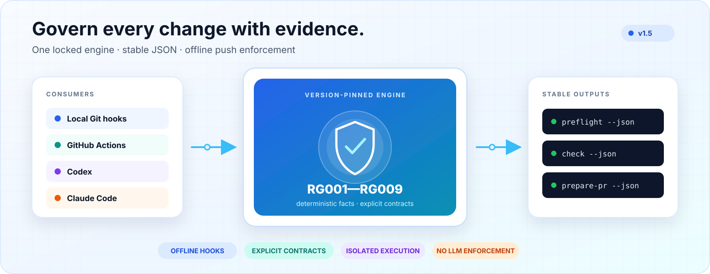
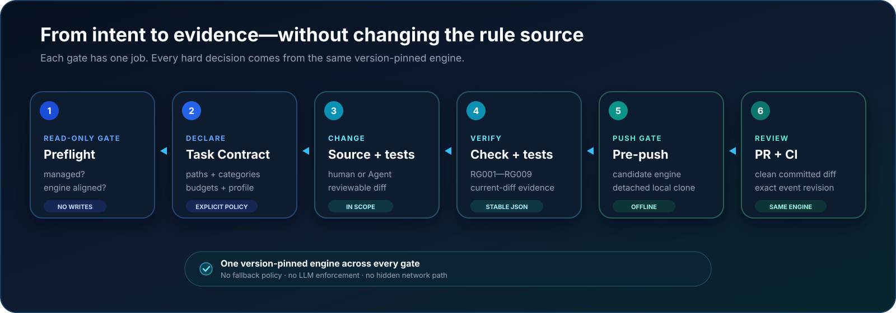
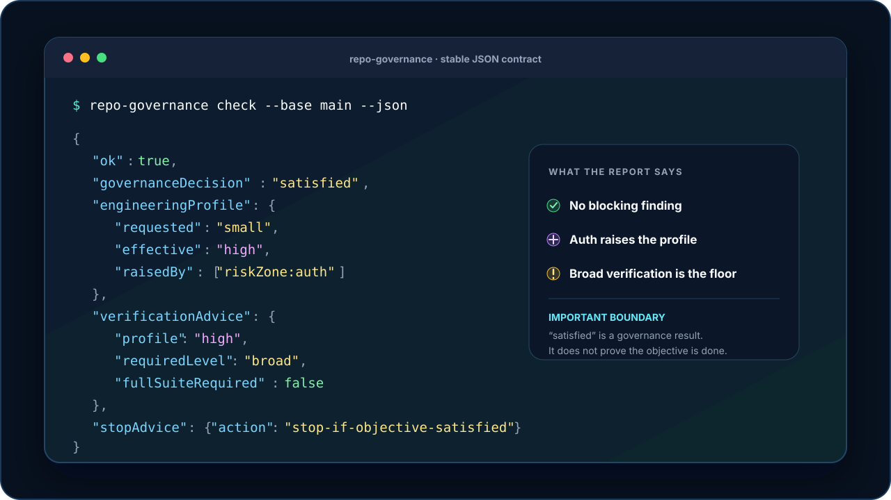

# repo-governance

[English](./README.md) · [简体中文](./README.zh-CN.md)

<picture>
  <source media="(prefers-color-scheme: dark)" srcset="./docs/assets/readme/hero-dark.svg">
  <source media="(prefers-color-scheme: light)" srcset="./docs/assets/readme/hero-light.svg">
  
</picture>

<p align="center"><strong>One version-pinned governance engine for local Git hooks, CI, Codex, and Claude Code.</strong></p>

<p align="center">
  <a href="https://github.com/CoaseEdge/repo-governance/actions/workflows/ci.yml"></a>
  <a href="https://github.com/CoaseEdge/repo-governance/actions/workflows/repo-governance.yml"></a>
  <a href="https://github.com/CoaseEdge/repo-governance/releases/latest"></a>
  <a href="./package.json"></a>
  <a href="./LICENSE"></a>
  
</p>

`repo-governance` turns repository policy into deterministic, explainable checks. It keeps the rules used by developers, coding Agents, Git hooks, and GitHub Actions aligned to the same locked engine instead of asking every integration to reinterpret policy.

Critical push enforcement is fully offline. The engine does not use an LLM to make hard decisions, infer risk from code semantics, rewrite source, or claim that a task is complete.

## Why repo-governance

| One rule source | Proportional engineering | Verifiable evidence |
| --- | --- | --- |
| Local hooks, CI, Codex, and Claude Code consume the same stable JSON contract. | Task scope, change categories, complexity budgets, and risk zones keep the proof proportional to the change. | Version-pinned engines, exact revisions, isolated execution, and current-diff test evidence make results reproducible. |

## How it works



The three gates have distinct responsibilities:

- `preflight` is the read-only Agent gate that decides whether repository work may start.
- The installed pre-push Hook verifies every pushed tip with the candidate commit's locked engine in an isolated local clone.
- `prepare-pr` checks the clean committed change set and creates a deterministic PR report and body draft without writing GitHub state.

The preflight JSON fields are independent: `ok` says inspection completed, `status` describes the workflow result, and `repoState` describes repository adoption. Writes are allowed only for `status: "succeeded"` with `repoState: "managed"`. Optional Agent policy may authorize an explicit preset for bootstrap; it never authorizes `github enforce --confirm`, pull-request creation or comments, or `ruleset` changes.

## Governance map

| Rule | What it governs |
| --- | --- |
| `RG001` | Requires configured companion test changes or successful declared test execution for high-impact changes. |
| `RG002` | Keeps executable tests in exactly one of `pr-blocking`, `nightly`, or `manual-smoke`. |
| `RG003` | Ensures protected workflows call the declared central policy source instead of duplicating it. |
| `RG004` | Locks public command definitions and requires affected tests, docs, and workflow consumers to move with an accepted change. |
| `RG005` | Binds waiver approval to an allowed reviewer, the current PR head, and the governed business diff. |
| `RG006` | Verifies runtimes, package managers, dependency preparation, ordered execution stages, and their consumers. |
| `RG007` | Enforces repository-defined architecture dependencies and reports cycles, drift metrics, and health scores. |
| `RG008` | Enforces Task Contract paths and scope budgets while reporting deterministic task drift. |
| `RG009` | Enforces authorized change categories and proportional budgets for files, lines, and tests. |

These rules report declared repository facts. They do not prove semantic correctness, assertion quality, runtime call direction, or that the user's objective has been achieved.

## What v1.5 adds

[Version 1.5](./docs/v1.5-release.md) adds deterministic proportional-engineering governance while keeping configuration schema version 1, pre-push protocol version 1, and execution-contract version 1 compatible.

- **Task Contract v2** adds `small`, `standard`, `high`, and `critical` engineering profiles.
- **RG009** measures new files, added lines, test files, and test added lines from the canonical Git diff.
- **Explicit authorization** maps repository paths to change categories that a task must declare before use.
- **Risk zones** may raise—but never lower—the effective engineering profile.
- **Bounded advice** returns a verification floor and a `satisfied`, `needs-confirmation`, or `blocked` governance decision.
- **Current-diff evidence** lets RG001 accept declared test execution without treating a local receipt as portable proof.

Exact content-preserving renames do not consume RG009 new-file or added-line budgets. The engine never infers a category, profile, or risk level from a filename or code meaning.

## Quick start

### Install from source

Development and source installation require Node.js 22 and npm 10.9.2. Verified platform bundles are also published on the [latest GitHub Release](https://github.com/CoaseEdge/repo-governance/releases/latest).

```sh
git clone https://github.com/CoaseEdge/repo-governance.git
cd repo-governance
npm ci
npm run install:local
```

The installer builds the engine and self-contained launcher, stores versioned data under the platform user-data directory, and creates the managed `repo-governance` entry. It never edits a shell profile; when the user bin directory is missing from `PATH`, it returns an explicit command to apply.

### Adopt an existing repository

Choose a preset explicitly—repo-governance never guesses one:

```sh
cd existing-repository
repo-governance bootstrap --preset node-library --json
```

Available presets are `node-library`, `node-service`, `react-web`, `tauri-desktop`, and `python-service`. Bootstrap writes the governance configuration and thin GitHub Actions caller, connects the existing pre-push Hook, and rolls back files it created if adoption fails.

### Create or clone with governance

```sh
repo-governance new my-service --preset node-service --json
repo-governance clone https://example.com/team/project.git --preset node-service --json
```

`new` creates a governance-only repository; it does not generate application code. `clone` preserves history and leaves generated governance files uncommitted for review. Native `git init` and `git clone` are never intercepted.

## Daily workflow



```sh
# Before an Agent changes repository files or runs task tests
repo-governance preflight --json

# Inspect the current repository change
repo-governance check --json

# Record successful declared test execution for the current diff
repo-governance verify-test --entry <id> --json

# After the intended changes are committed and the worktree is clean
repo-governance prepare-pr --json
```

The pre-push Hook runs automatically after adoption. It captures Hook input safely, preserves an existing Hook as a verified sidecar, and runs each unique pushed tip/base pair in a detached local clone. It never fetches or falls back to mutable workspace configuration, a default engine, or the legacy `check` path.

## Command surface

| Workflow | Commands |
| --- | --- |
| Repository lifecycle | `init`, `bootstrap`, `new`, `clone`, `update` |
| Change governance | `preflight`, `check`, `verify-test`, `prepare-pr` |
| Architecture and failure baselines | `architecture baseline`, `architecture drift`, `baseline create`, `baseline compare` |
| Hook management | `hooks install`, `connect`, `doctor`, `disconnect`, `uninstall` |
| Local inventory | `repositories list/register/unregister`, `engines list/prune` |
| Verified distribution | `install`, `update`, `version check`, `skills install` |
| GitHub enforcement | `github validate-waivers`, `github enforce` |

Destructive or remote actions require explicit command variants such as `engines prune --confirm` or `github enforce --confirm`. Their dry-run or unconfirmed forms remain read-only.

## Architecture and task contracts

| Contract | Lifetime | Purpose |
| --- | --- | --- |
| [Architecture contract](./docs/architecture-governance.md) | Repository-wide and long-lived | Declares layers, modules, and allowed dependency directions for RG007. |
| [Architecture baseline](./docs/architecture-drift.md) | Repository-wide snapshot | Tracks structural drift and a deterministic 0–100 health score. |
| [Task Contract](./docs/change-scope-governance.md) | One objective and short-lived | Declares allowed paths, scope, change categories, budgets, and engineering profile for RG008/RG009. |
| [Execution contract](./docs/execution-contracts.md) | Versioned repository policy | Declares runtimes and the ordered dependency, build, codegen, and test graph for RG006. |

Every contract is explicit. Architecture and Task Contracts remain opt-in for existing repositories; missing declarations remain missing, and the engine does not synthesize policy from project conventions.

## Codex and Claude Code

Agent-neutral advisory knowledge lives in `playbooks/`. Eight thin Codex Skills and eight matching Claude Code command templates invoke the locked CLI and explain its structured report. They do not reimplement hard rules or override governance decisions.

The shared advisors cover test impact, test-tier classification, CI failure triage, public command protection, architecture review, change-scope review, the Agent preflight gate, and adoption. See [Agent adapters](./docs/agent-adapters.md) for the contract and installation model.

## Safety model

- **Offline enforcement:** preflight, checks, Git Hooks, architecture analysis, scope evaluation, and pre-push verification do not access the network. `repo-governance version check` is the only version-advisory network command.
- **Revision-bound execution:** pre-push reads the candidate commit's engine identity and protocol; CI uses the exact event head and base SHAs.
- **Fail closed:** missing protocol fields, incompatible versions, damaged configuration, and missing or corrupt engines block execution instead of selecting a fallback.
- **Least privilege:** the core pull-request check receives read-only contents and pull-request permissions; optional reporting is isolated from untrusted checkout execution.
- **Verified releases:** platform archives carry checksums and GitHub artifact attestations; the release catalog has a separate detached Ed25519 signature.
- **Explicit remote writes:** GitHub enforcement is read-only unless `--confirm` is supplied, and successful writes are verified by reading the effective rules back.

See [Adoption model](./docs/adoption-model.md), [signed release catalog](./docs/release-catalog.md), and [v1.5 release boundary](./docs/v1.5-release.md) for the full guarantees and limitations.

## Documentation

| Topic | Guide |
| --- | --- |
| Presets and repository adoption | [Presets](./docs/presets.md) · [Adoption model](./docs/adoption-model.md) · [Agent automatic adoption](./docs/agent-auto-adoption.md) |
| Execution and CI | [Execution contracts](./docs/execution-contracts.md) · [Task failure baselines](./docs/task-failure-baseline.md) |
| Architecture | [Architecture governance](./docs/architecture-governance.md) · [Architecture drift](./docs/architecture-drift.md) |
| Task scope and proportional engineering | [Change scope governance](./docs/change-scope-governance.md) · [v1.5 release](./docs/v1.5-release.md) |
| Agent integrations | [Agent adapters](./docs/agent-adapters.md) · [Codex adapter](./adapters/codex/README.md) · [Claude Code adapter](./adapters/claude-code/README.md) |
| Releases and upgrades | [Release catalog](./docs/release-catalog.md) · [Release history](./docs/v1.4-release.md) |

## Development

Use Node.js 22:

```sh
npm ci
npm run check:static
npm test
```

Build the self-contained CLI and version-aware launcher with `npm run build:sea`. Hook and adoption tests always use isolated temporary homes and repositories; development must never enroll or modify unrelated existing repositories.

Licensed under the [MIT License](./LICENSE).
